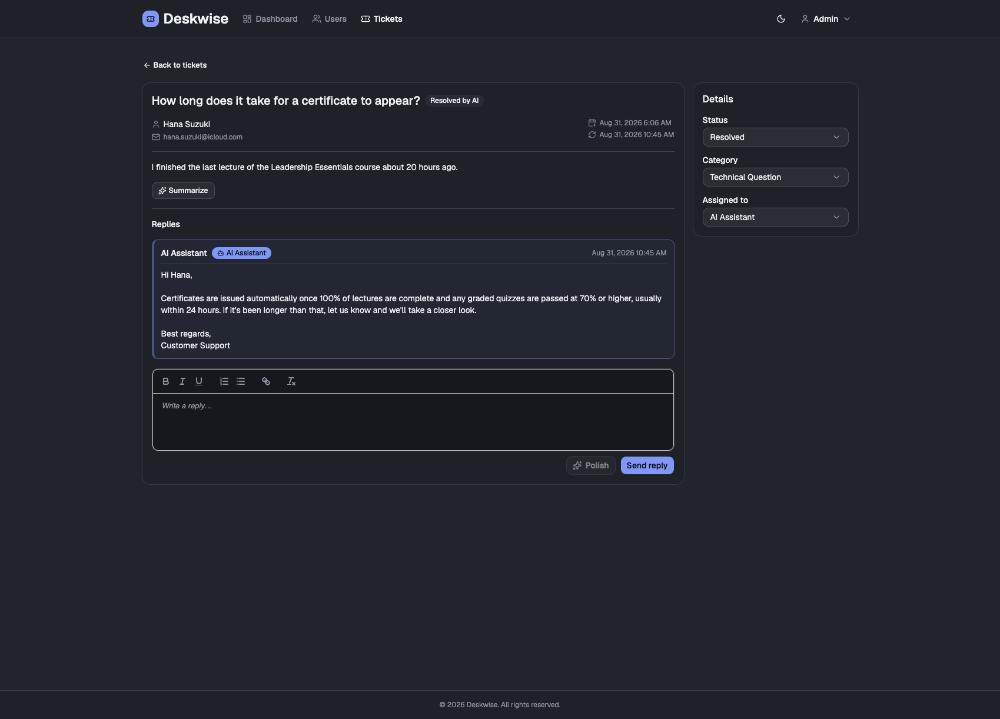
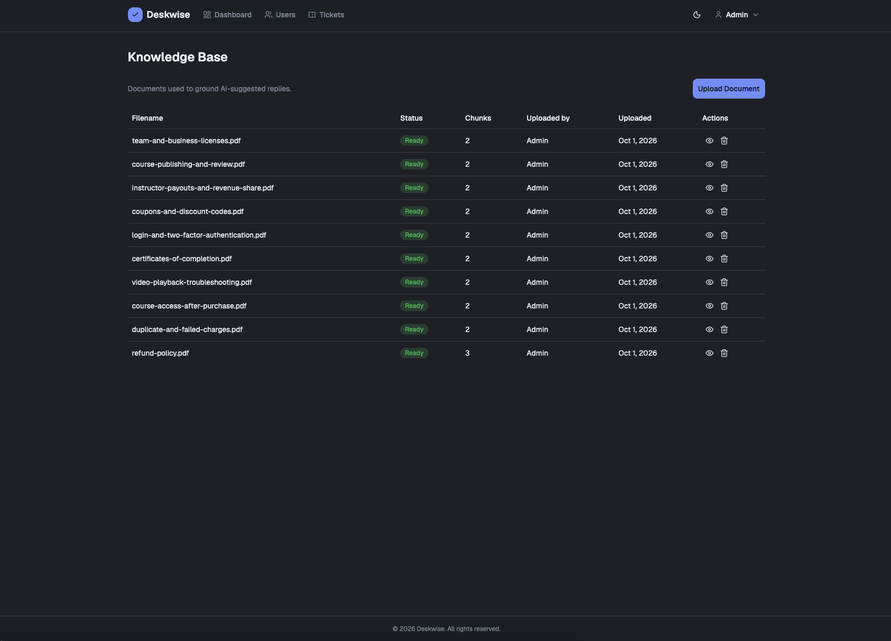
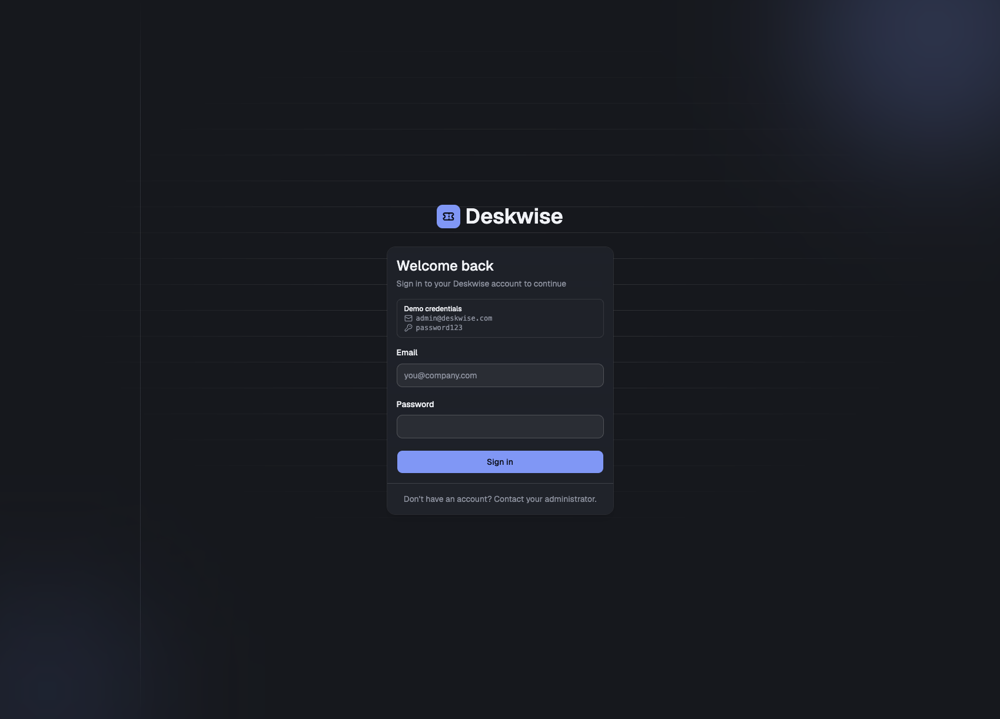
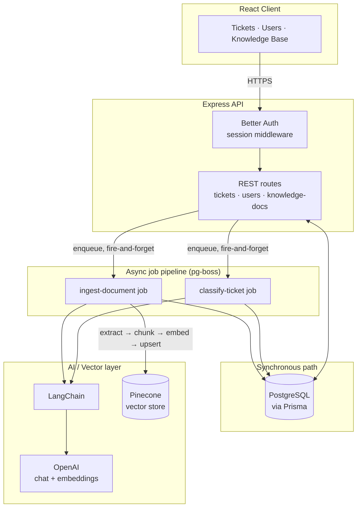

<div align="center">

# 🎫 Deskwise

### AI-Powered Support Ticket Management System

Support emails become tickets that are auto-classified, summarized, and given AI-suggested replies grounded in a real retrieval-augmented knowledge base — with a full management interface for agents and admins.

[](https://react.dev)
[](https://www.typescriptlang.org)
[](https://expressjs.com)
[](https://www.postgresql.org)
[](https://www.langchain.com)
[](https://www.pinecone.io)
[](https://bun.sh)

</div>

---

## Table of Contents

- [Overview](#overview)
- [Screenshots](#screenshots)
- [Features](#features)
- [Architecture](#architecture)
- [Tech Stack](#tech-stack)
- [Security](#security)
- [Getting Started](#getting-started)
- [Project Structure](#project-structure)
- [Development Process](#development-process)
- [Roadmap](#roadmap)
- [License](#license)

---

## Overview

Support teams drown in repetitive email traffic — the same shipping, returns, and account questions, answered one at a time. Deskwise turns inbound support email into a structured ticket queue, then uses AI to lighten the manual load at every step: tickets are auto-classified as they arrive, agents get one-click AI summaries of long threads, AI-polished replies that stay in the agent's own voice, and — via a retrieval-augmented knowledge base — replies that can be grounded in the team's own shipping/returns/policy documents instead of the model's guesswork.

It's a full-stack TypeScript monorepo: an Express API backed by Postgres/Prisma, a React admin/agent interface, and an async job pipeline (pg-boss) that keeps every LLM and vector-database call off the request path.

## Screenshots

<!-- Add a screenshot at docs/screenshots/tickets-list.png -->
### Tickets List


<!-- Add a screenshot at docs/screenshots/ticket-detail.png -->
### Ticket Detail — AI Summary & Reply Polish



<!-- Add a screenshot at docs/screenshots/knowledge-base.png -->
### Knowledge Base (RAG document management)



<!-- Add a screenshot at docs/screenshots/user-management.png -->
### User Management


<!-- Add a screenshot at docs/screenshots/login.png -->
### Login



## Features

**Ticket Management**
- Paginated, sortable, filterable ticket list (by subject, status, category)
- Ticket detail view with a threaded reply history
- Assignment to agents, status transitions (Open → Resolved → Closed)
- Inbound-email webhook intake — automatically dedupes into an existing open ticket for the same sender + subject instead of creating duplicates

**AI-Powered Features** (all via [LangChain](https://www.langchain.com), never a provider SDK called directly — see [Architecture](#architecture))
- 🏷️ **Auto-classification** — every inbound ticket is classified (general question / technical question / refund request) asynchronously, without blocking the webhook response
- 📝 **AI summaries** — one click to summarize a long ticket + reply thread for an agent picking it up cold
- ✍️ **AI reply polish** — improves an agent's draft (grammar, clarity, tone) while preserving their own wording and intent
- 📚 **Retrieval-augmented knowledge base** — admins upload PDF/DOCX/TXT/MD policy docs; they're chunked, embedded, and stored in Pinecone so future AI features can ground replies in the team's actual documentation instead of hallucinating

**User Management & Auth**
- Session-based authentication (no public sign-up — admin-provisioned accounts only)
- Admin/Agent roles with route- and API-level authorization
- Soft-delete with session revocation, not destructive hard deletes

## Architecture

Deskwise is a Bun workspace monorepo with three packages: `packages/server` (Express 5 API), `packages/client` (React 19 SPA), and `packages/core` (Zod schemas and const-object enums shared by both, so the client and server can never drift on validation rules or status values).

The core architectural rule: **any request that would call an LLM or a vector database never blocks the HTTP response.** Ticket classification and knowledge-base ingestion are both handed off to [pg-boss](https://github.com/timgit/pg-boss) (a Postgres-backed job queue — no separate Redis/SQS infra needed) and processed by background workers, so a slow OpenAI call or a Pinecone hiccup can never make an API request hang.



**Key decisions worth knowing about:**

- **LangChain-only AI access.** Every AI feature — chat completions and embeddings alike — goes through LangChain's abstractions (`@langchain/core`, `@langchain/openai`, `@langchain/pinecone`), never a provider SDK called directly. This is a deliberate standing rule, not incidental to how the first two features happened to be built.
- **RAG ingestion pipeline.** An uploaded document is extracted (`pdf-parse` / `mammoth` / plain text read depending on type), chunked (~1000 characters with ~200 character overlap so no sentence is orphaned at a chunk boundary), embedded with `text-embedding-3-small`, and upserted into Pinecone with per-chunk metadata (`docId`, `filename`, `chunkIndex`, `uploadedAt`). Vector IDs are minted as `<docId>#<chunkIndex>` — a deliberate choice so that deleting a document can list-then-delete by ID prefix, since Pinecone serverless indexes don't reliably support metadata-filter deletion.
- **Fail loud, never auto-provision.** If the configured Pinecone index doesn't exist, or its dimension doesn't match the embedding model's output, ingestion fails immediately with a clear, stored error message — the app never silently creates or resizes infrastructure on your behalf.
- **Soft delete over hard delete.** Deleting a user never removes the row — it sets `deletedAt`, revokes every session, and frees the email address for reuse by overwriting it, so ticket history stays intact for anyone who worked a ticket in the past.
- **Local file storage today, object storage next.** Uploaded knowledge-base documents currently live on local disk (gitignored) — the deliberate, simplest option for the current stage. Migrating to S3 is planned once the app moves onto AWS infrastructure (see [Roadmap](#roadmap)).

## Tech Stack

<table>
<tr>
<td valign="top" width="50%">

**Frontend**

[](https://react.dev)
[](https://www.typescriptlang.org)
[](https://vite.dev)
[](https://tailwindcss.com)
[](https://reactrouter.com)
[](https://tanstack.com/query)
[](https://tanstack.com/table)

shadcn/ui component system, built on Base UI primitives · React Hook Form + Zod resolvers · Quill rich-text editor

</td>
<td valign="top" width="50%">

**Backend**

[](https://bun.sh)
[](https://expressjs.com)
[](https://www.typescriptlang.org)
[](https://www.postgresql.org)
[](https://www.prisma.io)
[](https://zod.dev)

Better Auth (session-based) · pg-boss (Postgres-backed job queue) · Helmet · express-rate-limit · DOMPurify + jsdom · multer

</td>
</tr>
<tr>
<td valign="top" width="50%">

**AI & Vector Search**

[](https://www.langchain.com)
[](https://platform.openai.com)
[](https://www.pinecone.io)

Chat completions + `text-embedding-3-small` embeddings via `@langchain/openai` · `@langchain/pinecone`'s `PineconeStore` for RAG · `pdf-parse` / `mammoth` for document text extraction

</td>
<td valign="top" width="50%">

**Tooling & Workspace**

[](https://bun.sh)
[](https://eslint.org)
[](https://prettier.io)

Bun workspaces monorepo (`packages/server`, `packages/client`, `packages/core`) · Husky + lint-staged pre-commit formatting

</td>
</tr>
</table>

## Security

This section documents the actual mechanisms in the codebase, not a generic checklist.

**Authentication & Sessions**
- [Better Auth](https://www.better-auth.com) with `disableSignUp: true` — there is no public registration; every account is admin-provisioned, matching an admin-creates-agents model
- Passwords are hashed via Better Auth's own `hashPassword` — the app never rolls its own hashing
- A sign-in hook blocks any soft-deleted user with a `FORBIDDEN` error, even if their old session token still exists somewhere
- `requireAuth` middleware validates every protected request's session before any route handler runs

**Authorization**
- `requireAdmin` middleware gates admin-only routes (user management, knowledge-base management) — always composed *after* `requireAuth`
- Role checks compare against shared const-object enums (`Role.admin`) from `packages/core`, never raw string literals, on both client and server

**Rate Limiting** — every limiter below uses a 15-minute sliding window (`express-rate-limit`, RFC draft-8 headers):

| Limiter | Limit | Protects |
|---|---|---|
| `authLimiter` | 20 / 15 min | Credential (sign-in) paths |
| `inboundEmailLimiter` | 50 / 15 min | Inbound-email webhook |
| `polishLimiter` | 20 / 15 min | AI reply-polish endpoint |
| `summarizeLimiter` | 20 / 15 min | AI ticket-summarize endpoint |
| `knowledgeUploadLimiter` | 10 / 15 min | Knowledge-base document upload |

**Input Validation & Sanitization**
- Every mutating request body is validated against a shared Zod schema (`packages/core`) before touching the database
- All stored rich-text HTML (`bodyHtml` on tickets and replies) is run through DOMPurify against a server-side jsdom window before persisting — mitigates stored XSS from customer email HTML or agent rich-text replies

**File Upload Safety**
- Knowledge-base uploads are restricted to an explicit extension allowlist (`.pdf`, `.docx`, `.txt`, `.md`) checked against the filename itself — not the browser-supplied Content-Type, which is spoofable and, for `.md` specifically, often missing or inconsistent
- 20MB size limit enforced server-side
- Stored filenames are UUID-prefixed to eliminate collisions and prevent any path-traversal risk from a user-supplied original filename

**Webhook Security**
- The inbound-email webhook requires an `x-webhook-secret` header, compared against the configured secret using `crypto.timingSafeEqual` — a constant-time comparison that avoids leaking the correct secret one byte at a time via response-timing side channels

**Network & Transport**
- `helmet()` applies standard secure HTTP headers on every response
- CORS is an explicit allowlist (`TRUSTED_ORIGINS`), not a wildcard — the same allowlist is shared with Better Auth's own origin check, since Better Auth validates the request origin independently of Express's CORS layer

**Error Handling**
- A single centralized error handler maps known Prisma errors to the right HTTP status (unique-constraint → 409, not-found → 404) and returns a generic message for everything else — internal error details and stack traces are never leaked to the client

**Data Handling**
- User deletion is a soft delete: the row is never removed, all sessions are revoked immediately, and the email is overwritten so it can be reused — while admin accounts are explicitly protected from deletion entirely
- The Pinecone index is never auto-created or resized — a missing or mismatched index fails the upload loudly with a clear stored error rather than silently provisioning cloud infrastructure

## Getting Started

**Prerequisites:**

- [Bun](https://bun.sh) — install with:
  ```bash
  curl -fsSL https://bun.sh/install | bash
  ```
- A PostgreSQL database (a free hosted instance works fine — see the tip in `packages/server/prisma/schema.prisma`)
- An OpenAI API key
- A Pinecone account with an index already created

```bash
# 1. Clone the repo and install workspace dependencies (root, server, client, core — all at once)
git clone <this-repo>
cd desky
bun install

# 2. Configure environment
cp packages/server/.env.example packages/server/.env
# then fill in every value below
```

| Variable | Purpose |
|---|---|
| `DATABASE_URL` | PostgreSQL connection string |
| `BETTER_AUTH_SECRET` | Signs/encrypts sessions and tokens |
| `BETTER_AUTH_URL` | Base server URL, used for auth callbacks |
| `ADMIN_EMAIL` / `ADMIN_PASSWORD` | Initial admin account, used by `bun run seed` |
| `TRUSTED_ORIGINS` | Comma-separated allowed CORS origins |
| `WEBHOOK_SECRET` | Shared secret for the inbound-email webhook |
| `OPENAI_API_KEY` | Powers classification, summarize, polish, and embeddings |
| `OPENAI_MODEL` | Optional, defaults to `gpt-5-nano` |
| `OPENAI_EMBEDDING_MODEL` | Optional, defaults to `text-embedding-3-small` (1536 dimensions) |
| `PINECONE_API_KEY` | Pinecone API key |
| `PINECONE_INDEX_NAME` | Name of an **existing** Pinecone index with a matching dimension — this app never creates one for you |

```bash
# 3. Set up the database (run these yourself — they need an interactive terminal)
cd packages/server
bunx prisma migrate dev
cd ../..

# 4. Seed demo data (from packages/server, in this order)
cd packages/server
bun run seed                 # admin user
bun run seed:users           # demo agent roster
bun run seed:tickets         # 100 demo tickets
bun run seed:knowledge-base  # 6 demo policy PDFs, ingested into Pinecone
cd ../..

# 5. Run it
bun run dev
```

The client runs at `http://localhost:5173`, the API at `http://localhost:3000`.

## Project Structure

```
desky/
├── packages/
│   ├── server/           # Express 5 API
│   │   ├── routes/       # tickets, users, knowledge-docs
│   │   ├── lib/          # tickets/ (AI features), knowledge-base/ (RAG pipeline)
│   │   ├── jobs/         # pg-boss workers (classify-ticket, ingest-document)
│   │   ├── middleware/   # auth, rate limiting, error handling
│   │   └── prisma/       # schema, migrations, seed scripts
│   ├── client/           # React 19 SPA
│   │   └── src/
│   │       ├── pages/        # route-level views
│   │       ├── components/   # tickets/, users/, knowledge-base/, ui/ (shadcn)
│   │       └── hooks/
│   └── core/             # shared Zod schemas + const-object enums
└── docs/                 # product scope, tech stack, implementation plan
```

## Development Process

[](https://claude.com/claude-code)

This project was built with [Claude Code](https://claude.com/claude-code), Anthropic's agentic coding CLI, used deliberately as an engineering tool rather than a shortcut — worth stating plainly, since "do you actually know how to work with AI coding tools" is a question that comes up directly in interviews.

To be specific about what that meant in practice: this wasn't vibe coding. Every non-trivial feature went through an explicit **plan-before-code** process — research the existing codebase and its conventions first, design an approach, review it, *then* implement — rather than accepting the first thing generated. Implementations were **verified by actually running the app**, not just by reading the code and trusting it: the RAG ingestion pipeline was tested through real uploads against a real Pinecone index, edge cases like invalid file types, oversized uploads, and non-admin access were exercised directly against a running server, and a real bug in the seed script's idempotency logic was caught — and fixed — by deliberately reproducing a fresh-clone scenario instead of assuming the happy path was the only path. The codebase also went through a dedicated simplification pass afterward to find and remove unnecessary complexity, not just to add features and move on.

The goal wasn't "AI wrote this app" — it's using AI the way a competent engineer uses any powerful tool: with a plan, with verification, and with judgment about what's actually good enough to ship.

## Roadmap

- 📊 Dashboard with real ticket analytics (currently a placeholder page)
- 📤 Outbound email sending (currently inbound-only via webhook)
- 🐳 Docker + cloud deployment configuration
- ☁️ Migrate knowledge-base file storage from local disk to AWS S3 once the app moves onto AWS infrastructure

## License

No license has been set for this repository yet — it's currently a personal/portfolio project.
