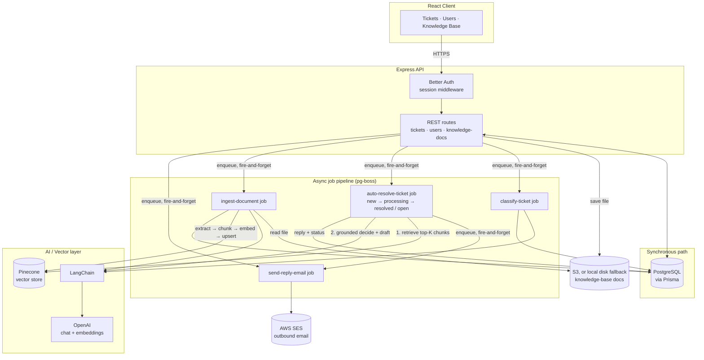

<div align="center">

# Deskwise

### AI-Powered Support Ticket Management System

Support emails become tickets that are auto-classified, summarized, and given AI-suggested replies grounded in a real retrieval-augmented knowledge base — with a full management interface for agents and admins.

[](https://react.dev)
[](https://www.typescriptlang.org)
[](https://expressjs.com)
[](https://www.postgresql.org)
[](https://www.langchain.com)
[](https://www.pinecone.io)
[](https://sentry.io)
[](https://bun.sh)

</div>

---

## Table of Contents

- [Overview](#overview)
- [Screenshots](#screenshots)
- [Features](#features)
- [Architecture](#architecture)
- [Tech Stack](#tech-stack)
- [Security](#security)
- [Getting Started](#getting-started)
- [Project Structure](#project-structure)
- [Development Process](#development-process)
- [Roadmap](#roadmap)
- [License](#license)

---

## Overview

Support teams drown in repetitive email traffic — the same shipping, returns, and account questions, answered one at a time. Deskwise turns inbound support email into a structured ticket queue, then uses AI to lighten the manual load at every step: the moment a ticket arrives, it's checked against a retrieval-augmented knowledge base and **resolved automatically** — with a real, grounded email reply — if the knowledge base confidently answers it; everything else is auto-classified and left for an agent, who gets one-click AI summaries of long threads and AI-polished replies that stay in their own voice.

It's a full-stack TypeScript monorepo: an Express API backed by Postgres/Prisma, a React admin/agent interface, and an async job pipeline (pg-boss) that keeps every LLM and vector-database call off the request path.

## Screenshots

### Login


### Dashboard


### Tickets List


### Ticket Detail — Resolved by AI


### Knowledge Base (RAG document management)


### User Management


## Features

**Ticket Management**

- Paginated, sortable, filterable ticket list (by subject, status, category)
- Ticket detail view with a threaded reply history
- Assignment to agents, status transitions (Open → Resolved → Closed)
- Inbound-email webhook intake — automatically dedupes into an existing open ticket for the same sender + subject instead of creating duplicates
- Outbound email sending via AWS SES — every agent reply and AI auto-resolution reply is emailed to the customer, off the request path via a pg-boss job

**AI-Powered Features** (all via [LangChain](https://www.langchain.com), never a provider SDK called directly — see [Architecture](#architecture))

- 🤖 **Automatic resolution via RAG** — every new ticket is checked against the knowledge base the instant it arrives; if the retrieved excerpts fully and confidently answer it, a complete, ready-to-send email reply is generated and posted automatically (signed off "Customer Support") and the ticket is marked resolved — without ever landing in an agent's queue. Anything the knowledge base can't answer is left untouched and open for a human — see [How the RAG pipeline works](#how-the-rag-pipeline-works)
- 🏷️ **Auto-classification** — every inbound ticket is classified (general question / technical question / refund request) asynchronously, without blocking the webhook response
- 📝 **AI summaries** — one click to summarize a long ticket + reply thread for an agent picking it up cold
- ✍️ **AI reply polish** — improves an agent's draft (grammar, clarity, tone) while preserving their own wording and intent
- 📚 **Retrieval-augmented knowledge base** — admins upload PDF/DOCX/TXT/MD policy docs; they're chunked, embedded, and stored in Pinecone, powering the automatic resolution above instead of the model hallucinating an answer

**User Management & Auth**

- Session-based authentication (no public sign-up — admin-provisioned accounts only)
- Admin/Agent roles with route- and API-level authorization
- Soft-delete with session revocation, not destructive hard deletes

## Architecture

Deskwise is a Bun workspace monorepo with three packages: `packages/server` (Express 5 API), `packages/client` (React 19 SPA), and `packages/core` (Zod schemas and const-object enums shared by both, so the client and server can never drift on validation rules or status values).

The core architectural rule: **any request that would call an LLM or a vector database never blocks the HTTP response.** Ticket classification, automatic resolution, and knowledge-base ingestion are all handed off to [pg-boss](https://github.com/timgit/pg-boss) (a Postgres-backed job queue — no separate Redis/SQS infra needed) and processed by background workers, so a slow OpenAI call or a Pinecone hiccup can never make an API request hang.



**Key decisions worth knowing about:**

- **LangChain-only AI access.** Every AI feature — chat completions and embeddings alike — goes through LangChain's abstractions (`@langchain/core`, `@langchain/openai`, `@langchain/pinecone`), never a provider SDK called directly. This is a deliberate standing rule, not incidental to how the first few features happened to be built.
- **RAG ingestion pipeline.** An uploaded document is extracted (`pdf-parse` / `mammoth` / plain text read depending on type), chunked (~1000 characters with ~200 character overlap so no sentence is orphaned at a chunk boundary), embedded with `text-embedding-3-small`, and upserted into Pinecone with per-chunk metadata (`docId`, `filename`, `chunkIndex`, `uploadedAt`). Vector IDs are minted as `<docId>#<chunkIndex>` — a deliberate choice so that deleting a document can list-then-delete by ID prefix, since Pinecone serverless indexes don't reliably support metadata-filter deletion. See [How the RAG pipeline works](#how-the-rag-pipeline-works) for the retrieval half.
- **Ticket auto-resolution is a state machine, not a flag.** `Ticket.status` gains two internal-only values, `new` and `processing`, used only while the auto-resolve pipeline is deciding what to do with a ticket — they're never shown in the UI and can never be set manually (the ticket list always excludes them, and edits to them are rejected server-side). A ticket lands on `resolved` (AI answered) or `open` (needs a human) once the attempt finishes, and from there on behaves exactly like a human-resolved or human-touched ticket — there's no separate "resolved by AI, hide forever" flag. An agent can still tell it apart from the reply thread itself, which carries an AI Assistant–authored reply.
- **Fail loud, never auto-provision.** If the configured Pinecone index doesn't exist, or its dimension doesn't match the embedding model's output, ingestion (and auto-resolution's retrieval step) fails immediately with a clear error rather than the app silently creating or resizing infrastructure on your behalf — an auto-resolution failure specifically falls back to leaving the ticket `open` for a human, never stuck mid-pipeline.
- **Soft delete over hard delete.** Deleting a user never removes the row — it sets `deletedAt`, revokes every session, and frees the email address for reuse by overwriting it, so ticket history stays intact for anyone who worked a ticket in the past.
- **Knowledge-base storage is S3 with a local-disk fallback, not a hard dependency on either.** `lib/knowledge-base/storage.ts` picks its backend once, at module load, from whether `KNOWLEDGE_BASE_S3_BUCKET` is set: S3 when it is, otherwise local disk (gitignored, the original and still-simplest option for running without AWS at all). `KnowledgeDoc.path` is treated as an opaque handle (an S3 key or a local path) everywhere downstream — never read or constructed directly outside this module.
- **Outbound email is a direct AWS SES call, not LangChain.** The LangChain-only rule above is scoped to AI/LLM access — SES is a transactional email provider, so `lib/email/send-email.ts` calls `@aws-sdk/client-sesv2` directly, the same way `lib/knowledge-base/pinecone.ts` calls the Pinecone SDK directly. Sending is always handed to the `send-reply-email` pg-boss job rather than done inline, so neither an agent's reply submission nor the auto-resolve job ever blocks on SES.
- **Error tracking covers more than the request/response path.** Sentry (`@sentry/node` server-side, `@sentry/react` client-side) is wired up beyond the automatic cases (uncaught exceptions, unhandled promise rejections, Express route errors, React render crashes via a top-level `Sentry.ErrorBoundary`). A lot of this codebase deliberately catches an error, logs it, and keeps going instead of letting it bubble up — a failed job-enqueue, auto-resolve's fallback-to-`open` catch, a pg-boss worker that intentionally rethrows so pg-boss owns retry/backoff — and each of those sites calls `Sentry.captureException(err)` explicitly, since Sentry's automatic integrations would never otherwise see them. Both DSNs are optional; `Sentry.init()` silently no-ops without one, so it's safe to leave configured in every environment including local dev.

### Auto-resolution, in plain English

Think of it like a mailroom with a small robot helper. Every new ticket gets a secret, invisible stamp — `NEW` — until the robot picks it up and stamps it `PROCESSING` while it thinks. Nobody sees a ticket while it wears either stamp. The robot searches the team's own rulebook (the knowledge base) for pages about the question. If it finds a clear, complete answer, it writes a reply, signs it "Customer Support," and stamps the ticket `RESOLVED` — done, no human needed. If it can't find a good answer, or anything goes wrong, it just stamps the ticket `OPEN` and hands it to a human agent, exactly as if it had never tried.

```
        email arrives
              |
              v
             NEW   -------- hidden from agents
              |
              v
         PROCESSING -------- still hidden, robot is thinking
              |
              v
      search the knowledge base
              |
     +------------------+
     |                  |
     v                  v
found an answer    couldn't find one
     |                  |
     v                  v
 RESOLVED              OPEN
(AI wrote a reply)  (needs a human)
     |                  |
     +--- visible to agents now ---+
```

### Ticket classification, in plain English

At the very same moment, a second, completely separate little robot reads that same new ticket to figure out what _kind_ of question it is. It doesn't wait for the first robot and doesn't block anything — they both just quietly work on the ticket in the background. If a human agent already picked a category by hand before this robot finishes, the robot's guess is thrown away instead of overwriting the human's choice.

```
        email arrives
              |
              v
     category: none  -------- shown as "Uncategorized"
              |
              v
   robot reads the subject + message
              |
              v
        robot picks ONE:
      - General Question
      - Technical Question
      - Refund Request
              |
              v
   did a human already pick one?
              |
       +------+------+
       |             |
      yes            no
       |             |
       v             v
  keep the        save the
 human's pick    robot's label
```

### Knowledge-base ingestion, in plain English

Same mailroom, but now picture an admin dropping a new policy PDF into the robot's rulebook. The robot doesn't just staple it in — it reads it, copies out all the small pieces, and files each piece somewhere it can find it again fast later.

```
      admin uploads PDF
              |
              v
         PROCESSING -------- saved to disk, not searchable yet
              |
              v
       extract the text
              |
              v
     split into overlapping
          chunks
              |
              v
    embed each chunk into
        a vector (OpenAI)
              |
              v
    store the vectors in
      Pinecone, tagged with
      this document's id
              |
     +------------------+
     |                  |
     v                  v
  everything          something
   worked               broke
     |                  |
     v                  v
   READY               FAILED
(chunks are now      (error saved,
 searchable by the    admin can see
 auto-resolve robot)  why it failed)
```

Only once a document reaches `READY` can its chunks actually be found by the auto-resolution search above — a document stuck in `PROCESSING` or `FAILED` is invisible to it, the same way a `NEW`/`PROCESSING` ticket is invisible to agents.

### How the RAG pipeline works

Deskwise's knowledge base is a complete retrieval-augmented generation loop — an ingestion (write) half and a retrieval-and-generation (read) half — not just a document store bolted onto a chatbot.

**1. Ingestion — turning a document into searchable vectors.** When an admin uploads a policy document (`POST /api/knowledge-docs`), the file is saved and a `KnowledgeDoc` row is created as `processing`, then handed to a pg-boss job so the upload request returns immediately instead of blocking on extraction/embedding. The worker (`jobs/ingest-document-job.ts` → `lib/knowledge-base/ingest-document.ts`) extracts plain text, splits it into overlapping ~1000-character chunks, embeds each chunk with `text-embedding-3-small`, and upserts the vectors into Pinecone (`@langchain/pinecone`'s `PineconeStore`) — each one tagged with its source document and chunk index. The `KnowledgeDoc` row flips to `ready` (or `failed`, with the error saved) once that finishes.

**2. Retrieval + generation — answering a ticket from those vectors.** When a new support ticket arrives (`POST /api/tickets/inbound-email`), it's enqueued onto the `auto-resolve-ticket` job without blocking the webhook response (`jobs/auto-resolve-ticket-job.ts`). That job:

1. Embeds the ticket's subject + body with the same embedding model and runs a similarity search against Pinecone (`lib/knowledge-base/search-knowledge-base.ts`) to pull back the top-K most relevant chunks across every ingested document — the read-side counterpart to the ingestion pipeline above.
2. Hands those chunks to an LLM (`lib/tickets/auto-resolve-ticket.ts`) with a strict instruction: answer _only_ from the retrieved excerpts, never from outside knowledge, and say so honestly (`canResolve: false`) if they don't fully cover the question. This grounding step is what stops the model from confidently inventing a shipping or refund policy that doesn't exist.
3. If the model is confident the excerpts fully answer the ticket, it drafts a complete, ready-to-send email — greeting, grounded answer, "Customer Support" sign-off — which is posted as a reply from a synthetic AI Assistant account, and the ticket is marked `resolved`. If not, or if anything in the pipeline fails (empty knowledge base, a Pinecone or OpenAI error), the ticket is simply left `open` for a human, exactly as if auto-resolution had never been attempted.

This read path only ever runs once, at ticket creation — a follow-up email to an already-open ticket reuses that ticket instead of re-triggering resolution.

## Tech Stack

<table>
<tr>
<td valign="top" width="50%">

**Frontend**

[](https://react.dev)
[](https://www.typescriptlang.org)
[](https://vite.dev)
[](https://tailwindcss.com)
[](https://reactrouter.com)
[](https://tanstack.com/query)
[](https://tanstack.com/table)

shadcn/ui component system, built on Base UI primitives · React Hook Form + Zod resolvers · Quill rich-text editor · Sentry (error tracking)

</td>
<td valign="top" width="50%">

**Backend**

[](https://bun.sh)
[](https://expressjs.com)
[](https://www.typescriptlang.org)
[](https://www.postgresql.org)
[](https://www.prisma.io)
[](https://zod.dev)

Better Auth (session-based) · pg-boss (Postgres-backed job queue) · Helmet · express-rate-limit · DOMPurify + jsdom · multer · AWS SES (outbound email) · Sentry (error tracking)

</td>
</tr>
<tr>
<td valign="top" width="50%">

**AI & Vector Search**

[](https://www.langchain.com)
[](https://platform.openai.com)
[](https://www.pinecone.io)

Chat completions + `text-embedding-3-small` embeddings via `@langchain/openai` · `@langchain/pinecone`'s `PineconeStore` for RAG · `pdf-parse` / `mammoth` for document text extraction

</td>
<td valign="top" width="50%">

**Tooling & Workspace**

[](https://bun.sh)
[](https://eslint.org)
[](https://prettier.io)

Bun workspaces monorepo (`packages/server`, `packages/client`, `packages/core`) · Husky + lint-staged pre-commit formatting

</td>
</tr>
</table>

## Security

This section documents the actual mechanisms in the codebase, not a generic checklist.

**Authentication & Sessions**

- [Better Auth](https://www.better-auth.com) with `disableSignUp: true` — there is no public registration; every account is admin-provisioned, matching an admin-creates-agents model
- Passwords are hashed via Better Auth's own `hashPassword` — the app never rolls its own hashing
- A sign-in hook blocks any soft-deleted user with a `FORBIDDEN` error, even if their old session token still exists somewhere
- `requireAuth` middleware validates every protected request's session before any route handler runs

**Authorization**

- `requireAdmin` middleware gates admin-only routes (user management, knowledge-base management) — always composed _after_ `requireAuth`
- Role checks compare against shared const-object enums (`Role.admin`) from `packages/core`, never raw string literals, on both client and server

**Rate Limiting** — every limiter below uses a 15-minute sliding window (`express-rate-limit`, RFC draft-8 headers):

| Limiter                  | Limit       | Protects                       |
| ------------------------ | ----------- | ------------------------------ |
| `authLimiter`            | 20 / 15 min | Credential (sign-in) paths     |
| `inboundEmailLimiter`    | 50 / 15 min | Inbound-email webhook          |
| `polishLimiter`          | 20 / 15 min | AI reply-polish endpoint       |
| `summarizeLimiter`       | 20 / 15 min | AI ticket-summarize endpoint   |
| `knowledgeUploadLimiter` | 10 / 15 min | Knowledge-base document upload |

**Input Validation & Sanitization**

- Every mutating request body is validated against a shared Zod schema (`packages/core`) before touching the database
- All stored rich-text HTML (`bodyHtml` on tickets and replies) is run through DOMPurify against a server-side jsdom window before persisting — mitigates stored XSS from customer email HTML or agent rich-text replies

**File Upload Safety**

- Knowledge-base uploads are restricted to an explicit extension allowlist (`.pdf`, `.docx`, `.txt`, `.md`) checked against the filename itself — not the browser-supplied Content-Type, which is spoofable and, for `.md` specifically, often missing or inconsistent
- 20MB size limit enforced server-side
- Stored filenames are UUID-prefixed to eliminate collisions and prevent any path-traversal risk from a user-supplied original filename

**Webhook Security**

- The inbound-email webhook requires an `x-webhook-secret` header, compared against the configured secret using `crypto.timingSafeEqual` — a constant-time comparison that avoids leaking the correct secret one byte at a time via response-timing side channels

**Network & Transport**

- `helmet()` applies standard secure HTTP headers on every response
- CORS is an explicit allowlist (`TRUSTED_ORIGINS`), not a wildcard — the same allowlist is shared with Better Auth's own origin check, since Better Auth validates the request origin independently of Express's CORS layer

**Error Handling**

- A single centralized error handler maps known Prisma errors to the right HTTP status (unique-constraint → 409, not-found → 404) and returns a generic message for everything else — internal error details and stack traces are never leaked to the client
- Sentry reports errors server- and client-side for operational visibility, entirely separate from what's shown to the user — the client response above stays generic regardless of what Sentry captures

**Data Handling**

- User deletion is a soft delete: the row is never removed, all sessions are revoked immediately, and the email is overwritten so it can be reused — while admin accounts are explicitly protected from deletion entirely
- The Pinecone index is never auto-created or resized — a missing or mismatched index fails the upload loudly with a clear stored error rather than silently provisioning cloud infrastructure

## Getting Started

**Prerequisites:**

- [Bun](https://bun.sh) — install with:
   ```bash
   curl -fsSL https://bun.sh/install | bash
   ```
- A PostgreSQL database (a free hosted instance works fine — see the tip in `packages/server/prisma/schema.prisma`)
- An OpenAI API key
- A Pinecone account with an index already created
- *(Optional)* An AWS account, for outbound email via SES and/or knowledge base document storage via S3 — both are unconfigured by default and degrade gracefully: SES just skips sending (logged, not thrown) and the knowledge base falls back to a local `knowledge-base/` folder at the repo root, so the app runs fully locally without an AWS account

```bash
# 1. Clone the repo and install workspace dependencies (root, server, client, core — all at once)
git clone <this-repo>
cd desky
bun install

# 2. Configure environment
cp packages/server/.env.example packages/server/.env
# then fill in every value below
```

| Variable                         | Purpose                                                                                               |
| -------------------------------- | ----------------------------------------------------------------------------------------------------- |
| `DATABASE_URL`                   | PostgreSQL connection string                                                                          |
| `BETTER_AUTH_SECRET`             | Signs/encrypts sessions and tokens                                                                    |
| `BETTER_AUTH_URL`                | Base server URL, used for auth callbacks                                                              |
| `ADMIN_EMAIL` / `ADMIN_PASSWORD` | Initial admin account, used by `bun run seed`                                                         |
| `TRUSTED_ORIGINS`                | Comma-separated allowed CORS origins                                                                  |
| `WEBHOOK_SECRET`                 | Shared secret for the inbound-email webhook                                                           |
| `OPENAI_API_KEY`                 | Powers classification, summarize, polish, and embeddings                                              |
| `OPENAI_MODEL`                   | Optional, defaults to `gpt-5-nano`                                                                    |
| `OPENAI_EMBEDDING_MODEL`         | Optional, defaults to `text-embedding-3-small` (1536 dimensions)                                      |
| `PINECONE_API_KEY`               | Pinecone API key                                                                                      |
| `PINECONE_INDEX_NAME`            | Name of an **existing** Pinecone index with a matching dimension — this app never creates one for you |
| `AWS_REGION`                     | **Optional** — shared by SES and S3 below; unset disables SES (see note)                             |
| `AWS_ACCESS_KEY_ID`              | **Optional**, local dev only; omit in production (EC2 instance role is used instead)                  |
| `AWS_SECRET_ACCESS_KEY`          | **Optional**, local dev only; omit in production (EC2 instance role is used instead)                  |
| `SES_FROM_EMAIL`                 | **Optional** — a verified SES identity. Unset (or no `AWS_REGION`), `sendEmail()` logs and skips the send instead of failing — same "silently no-op" shape as Sentry below. Sandbox mode also requires the recipient to be verified |
| `SES_FROM_NAME`                  | Optional, defaults to `Customer Support`                                                               |
| `KNOWLEDGE_BASE_S3_BUCKET`       | **Optional** — S3 bucket for knowledge base documents. Unset, documents are stored on local disk at the repo root's `knowledge-base/` dir instead                                                     |
| `SENTRY_DSN`                     | Optional — server-side error tracking; unset means Sentry silently no-ops                             |
| `SENTRY_ENVIRONMENT`             | Optional — environment tag on Sentry events, falls back to `NODE_ENV`                                 |

The client has its own optional env file, used only for client-side error tracking — everything above is server-only:

```bash
cp packages/client/.env.example packages/client/.env
```

| Variable                  | Purpose                                                                    |
| -------------------------- | --------------------------------------------------------------------------- |
| `VITE_SENTRY_DSN`         | Optional — client-side error tracking; unset means Sentry silently no-ops |
| `VITE_SENTRY_ENVIRONMENT` | Optional — environment tag on Sentry events, falls back to Vite's `MODE`  |

```bash
# 3. Set up the database (run these yourself — they need an interactive terminal)
cd packages/server
bunx prisma migrate dev
cd ../..

# 4. Seed demo data (from packages/server, in this order — deterministic
#    and safe to re-run; see packages/server/prisma/scripts/README.md for
#    the full reset/reseed runbook)
cd packages/server
bun run seed                 # admin user + the AI Assistant bot account
bun run seed:users           # demo agent roster, grouped into informal support teams
bun run seed:tickets         # 140 demo tickets with reply threads, for a fictional online-learning-platform tenant ("Pathlight Academy")
bun run seed:knowledge-base  # 10 demo help-center PDFs, ingested into Pinecone
cd ../..

# 5. Run it
bun run dev
```

The client runs at `http://localhost:5173`, the API at `http://localhost:3000`.

## Project Structure

```
desky/
├── packages/
│   ├── server/           # Express 5 API
│   │   ├── routes/       # tickets, users, knowledge-docs
│   │   ├── lib/          # tickets/ (AI features), knowledge-base/ (RAG pipeline)
│   │   ├── jobs/         # pg-boss workers (classify-ticket, auto-resolve-ticket, ingest-document)
│   │   ├── middleware/   # auth, rate limiting, error handling
│   │   └── prisma/       # schema, migrations, seed scripts
│   ├── client/           # React 19 SPA
│   │   └── src/
│   │       ├── pages/        # route-level views
│   │       ├── components/   # tickets/, users/, knowledge-base/, ui/ (shadcn)
│   │       └── hooks/
│   └── core/             # shared Zod schemas + const-object enums
└── screenshots/           # README screenshots
```

## Development Process

[](https://claude.com/claude-code)

This project was built with [Claude Code](https://claude.com/claude-code), Anthropic's agentic coding CLI, used deliberately as an engineering tool rather than a shortcut — worth stating plainly, since "do you actually know how to work with AI coding tools" is a question that comes up directly in interviews.

To be specific about what that meant in practice: this wasn't vibe coding. Every non-trivial feature went through an explicit **plan-before-code** process — research the existing codebase and its conventions first, design an approach, review it, _then_ implement — rather than accepting the first thing generated. Implementations were **verified by actually running the app**, not just by reading the code and trusting it: the RAG ingestion pipeline was tested through real uploads against a real Pinecone index, automatic ticket resolution was exercised end-to-end against real inbound emails (an answerable question, an unanswerable one, an empty knowledge base, a broken Pinecone config, and a follow-up email to an already-open ticket, each checked against the real database afterward), edge cases like invalid file types, oversized uploads, and non-admin access were exercised directly against a running server, and a real bug in the seed script's idempotency logic was caught — and fixed — by deliberately reproducing a fresh-clone scenario instead of assuming the happy path was the only path. The codebase also went through a dedicated simplification pass afterward to find and remove unnecessary complexity, not just to add features and move on.

The goal wasn't "AI wrote this app" — it's using AI the way a competent engineer uses any powerful tool: with a plan, with verification, and with judgment about what's actually good enough to ship.

## Roadmap

- ✍️ Agent-facing suggested-reply drafting (an AI-written first draft for a human to review, as opposed to polishing an agent's own draft or full auto-resolution)
- 📧 Real email-provider ingestion (SendGrid/Mailgun inbound parse — currently a generic secret-gated JSON webhook)
- 🐳 Docker + cloud deployment configuration

## License

No license has been set for this repository yet — it's currently a personal/portfolio project.
